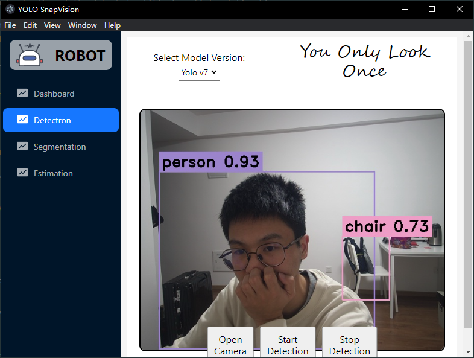

# YOLOSnapVision

YOLOSnapVision is a cutting-edge detection and recognition software powered by the YOLO (You Only Look Once) algorithm. This versatile application goes beyond traditional object detection and extends its capabilities to include target detection, instance segmentation, and posture recognition.

## Features

* Object Detection: 
YOLOSnapVision excels in object detection, accurately identifying and locating various objects within images and videos. The YOLO algorithm's real-time processing ensures swift and precise detection, making it an ideal tool for diverse applications.

* Instance Segmentation:
The software goes a step further by supporting instance segmentation. This advanced feature not only identifies objects but also segments them into distinct instances, providing more detailed and granular information about the detected entities.

* Pose Recognition:
YOLOSnapVision boasts posture recognition capabilities. It can analyze and recognize the posture or pose of individuals or objects within the images or videos, offering a comprehensive understanding of the detected entities' spatial relationships.

## Run-time Screenshots
Explore the powerful features of YOLOSnapVision through these runtime screenshots showcasing its user interface and real-time detection results.



## Getting Started
1. Clone the Repository
```
git clone https://github.com/GilbertPan97/Yolov7App
```

2. Navigate to the Project Directory
```
cd app
```

3. Install Dependencies
```
npm install    // or 'yarn install'
```

4. Run YOLOSnapVision in Development Mode:
```
npm run dev
```

5. Build YOLOSnapVision & preview:
```
npm run build     // Vue TypeScript Compiler (vue-tsc) and Vite.
npm run preview   // Preview the Production Build
```
This command uses Vue TypeScript Compiler (vue-tsc) and Vite to build the frontend. The resulting build is optimized for production deployment.

6. Build YOLOSnapVision for Windows/Linux:
```
npm run wbuild    // Build app on window
npm run lxbuild   // Build app on Linux
```
Run npm run wbuild/lxbuild, it triggers Electron Builder to create a Windows/linux-ready distribution of your YOLOSnapVision application, optimized for 64-bit systems, based on the configuration specified in electron-builder.yml. 

## Project Structure
```
YOLOSnapVision
│   backend
│   build
│   builder
│   dist
│   node_modules
│   out
│   public
│   src
│   electron-builder.yml
│   forge.config.cjs
│   index.html
│   main.js
│   package-lock.json
│   package.json
│   preload.js
│   README.md
│   tsconfig.json
│   tsconfig.node.json
│   vite.config.ts
│   vue.config.js
│   yarn.lock
```
* backend: Backend code for the YOLOSnapVision application.
* build: Build-related files and configurations.
* dist: Distribution files after building (Vue TypeScript Compiler and Vite) the frontend.
* node_modules: Node.js modules and dependencies.
* out: Output directory of Electron Builder to create a Windows/linux-ready distribution of your YOLOSnapVision application.
* public: Public assets and files.
* src: Source code for the YOLOSnapVision application, including frontend and backend.
* electron-builder.yml: Configuration file for Electron Builder.
* forge.config.cjs: Forge configuration file.
* index.html: Main HTML file for the application.
* main.js: Main JavaScript file.
* package-lock.json: npm package lock file.
* package.json: npm package configuration file.
* preload.js: Preload script for Electron.
* README.md: Project documentation.
* tsconfig.json: TypeScript configuration file.
* tsconfig.node.json: TypeScript configuration file for Node.js.
* vite.config.ts: Vite configuration file.
* vue.config.js: Vue.js configuration file.
* yarn.lock: Yarn package lock file.

## License
YOLOSnapVision is licensed under the GNU General Public License v3.0 (GPL-3.0). See the [LICENSE](../LICENSE) file for details.

## Contribution
We highly appreciate contributions from the community to improve this YOLOSnapVision application. You can contribute by submitting issues, feedback, bug fixes, or feature enhancements. Please refer to the repository for detailed contribution guidelines.

We hope you find this repository helpful and encourage you to explore and contribute to its development.